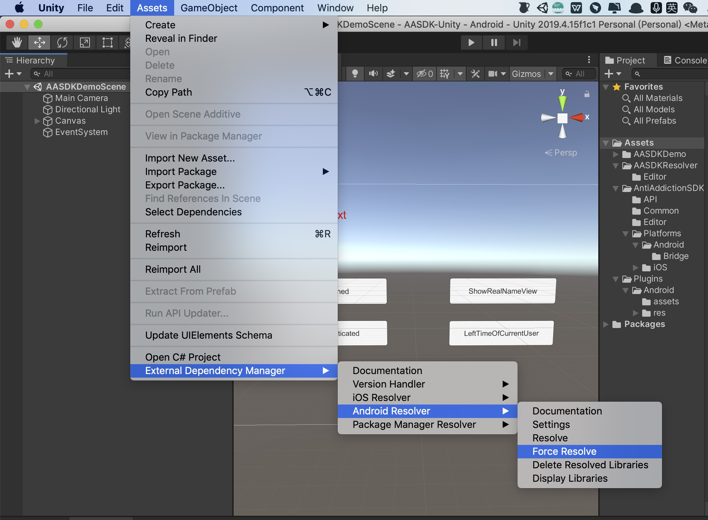

[toc]
# 1. Get Started

This guide is intended for publishers who want to integrate the Anti-Addiction system.

# 2. Prerequisites

- To deploy to iOS  
  - Xcode 10 or higher  
  - iOS 9.0 or higher  
  - [CocoaPods](https://guides.cocoapods.org/using/getting-started.html)  

- To deploy to Android  
  - Target Android API level 14 or higher  

- [Access to Demo](https://github.com/yumimobi/AASDK-Unity)

## 2.1 Download the AntiAddictionSystem Unity plugin  

The AntiAddictionSystem Unity plugin enables Unity developers to easily serve AntiAddictionSystemSDK on Android and iOS apps without having to write Java or Objective-C code. The plugin provides a C# interface for requesting ads that is used by C# scripts in your Unity project.

Use the links below to download the Unity package for the plugin or to take a look at its code on GitHub.  

[Download the Plugin](https://github.com/yumimobi/AASDK-Unity/releases/download/1.1.9/AASDK.unitypackage)    
[View Source Code](https://github.com/yumimobi/AASDK-Unity)  

## 2.2 Import the AntiAddictionSystem Unity plugin  
Open your project in the Unity editor.   
Select Assets > Import Package > Custom Package and find the AntiAddictionSystem.unitypackage file you downloaded.  


Make sure all of the files are selected and click Import.


## 2.3 Include the AntiAddictionSystem SDK

The AntiAddictionSystem Unity plugin is distributed with the Unity [Play Services Resolver library](https://github.com/googlesamples/unity-jar-resolver). This library is intended for use by any Unity plugin that requires access to Android specific libraries (e.g., AARs) or iOS CocoaPods. It provides Unity plugins the ability to declare dependencies, which are then automatically resolved and copied into your Unity project.

Follow the steps listed below to ensure your project includes the Atmosplay Ads SDK.

### 2.3.1 Deploy to iOS

No additional steps are required to include the AntiAddictionSystem SDK into the Unity project.

After building, open xcworkspace project.

*Note: iOS dependencies are identified using CocoaPods. CocoaPods is run as a post build process step.*  

### 2.3.2 Deploy to Android 

In the Unity editor, select `Assets > External Dependency Manager > Android Resolver > Force Resolve. The Unity Play Services Resolver library will copy the declared dependencies into the `Assets/Plugins/Android` directory of your Unity app.  


## 2.4 Config Parametrs
### 2.4.1 Config the iOS parameters
Add the following parameters into the `info.plist`.
You can find the `info.plist` in your Xcode project.

`warning: You can contact PM for all of these IDs .`

```xml
    <key>zgameid</key>
    <string>your game id</string>
    <key>zchannelid</key>
    <string>your channel id</string>
    <key>zplayKey</key>
    <string>your zplayKey</string>
```
### 2.4.2 Config the Android prameters
Modify the prameters in `Assets/Plugins/Android/assets/ZplayConfig.xml` file.
  

`warning: For GameID, ChannelID parameters in ZplayConfig.xml file, please contact PM for all of these IDs.`

# 3. Integration
## 3.1 Create AntiAddictionSDK object

```csharp
using System;
using UnityEngine;
using AntiAddictionSDK.Api;
using UnityEngine.UI;

public class AASDKDemoScript : MonoBehaviour {
AntiAddictionStytemSDK antiAddictionSDK;

  void Start() 
  {
    antiAddictionSDK = new AntiAddictionStytemSDK();
    antiAddictionSDK.OnTouristsModeLoginSuccess += HandleTouristsModeLoginSuccess;
    antiAddictionSDK.OnTouristsModeLoginFailed += HandleTouristsModeLoginFailed;
    antiAddictionSDK.RealNameAuthenticateSuccess += HandleRealNameAuthenticateSuccess;
    antiAddictionSDK.RealNameAuthenticateFailed += HandleRealNameAuthenticateFailed;
    antiAddictionSDK.RealNameAuthenticateFailedWithForceExit += HandleRealNameAuthenticateFailedWithForceExit;
    antiAddictionSDK.NoTimeLeftWithTouristsMode += HandleNoTimeLeftWithTouristsMode;
    antiAddictionSDK.NoTimeLeftWithNonageMode += HandleNoTimeLeftWithNonageMode;
    antiAddictionSDK.LeftTimeOfCurrentUserInEverySeconds += HandleLeftTimeOfCurrentUserInEverySeconds;
    antiAddictionSDK.RealNameAuthSuccessStatus += HandleRealNameAuthSuccessStatus;
    antiAddictionSDK.OnCurrentChannelUserInfo += HandleOnCurrentChannelUserInfo;
    antiAddictionSDK.OnUserGroupSuccessResult += HandleOnUserGroupSuccessResult;
  }
#region AntiAddictionStytemSDK callback handlers
    // Tourist login success event
    // Normaly you should ignore this event
    public void HandleTouristsModeLoginSuccess(object sender, LoginSuccessEventArgs args)
    {
        // get the tourist id
        String touristsID = args.Message;
        print("AntiAddiction---HandleTouristsModeLoginSuccess: " + touristsID);
    }
    // Tourist login failed event
    // Normaly you should ignore this event
    public void HandleTouristsModeLoginFailed(object sender, EventArgs args)
    {
        print("AntiAddiction---HandleTouristsModeLoginFailed");
    }

    // Real name authentication successful
    public void HandleRealNameAuthenticateSuccess(object sender, EventArgs args)
    {
        print("AntiAddiction---HandleRealNameAuthenticateSuccess");
    }
    // Real name authentication failed
    public void HandleRealNameAuthenticateFailed(object sender, EventArgs args)
    {
        print("AntiAddiction---HandleRealNameAuthenticateFailed");
    }


     // The user clicks to exit the game on the real-name authentication interface
    public void HandleRealNameAuthenticateFailedWithForceExit(object sender, EventArgs args)
    {
        print("AntiAddiction---HandleRealNameAuthenticateFailedWithForceExit");
    }

    // This method will be called when the tourist mode runs out of time 
    // Will present the real name authentication controller after 3 second
    public void HandleNoTimeLeftWithTouristsMode(object sender, EventArgs args)
    {
        print("AntiAddiction---HandleNoTimeLeftWithTouristsMode");
    }
    // This method will be called when the nonage mode runs out of time 
    // Will present the alert controller after 3 second
    public void HandleNoTimeLeftWithNonageMode(object sender, EventArgs args)
    {
        print("AntiAddiction---HandleNoTimeLeftWithNonageMode");
    }

    // Callback current user info
    // leftTime: remaining playable time，-1 means adult, unlimited
    public void HandleLeftTimeOfCurrentUserInEverySeconds(object sender, LeftTimeEventArgs args)
    {
        int leftTime = args.LeftTime;
        print("AntiAddiction---HandleTouristsModeLoginSuccess: " + leftTime);
    }

     // Android When calls the 4.9 UpdateDataReport interface, this callback is returned to notify the game of the successful status of real-name authentication.
    public void HandleRealNameAuthSuccessStatus(object sender, EventArgs args)
    {
        print("AntiAddiction---HandleRealNameAuthSuccessStatus: ");
    }

    // Android real-name authentication status for Lenovo channel users
    // 0：Not real-name authentication
    // 1：adults
    // 2：nonage
    public void HandleOnCurrentChannelUserInfo(object sender, ChannelUserInfoEventArgs args)
    {
        int realNameStatus = args.RealNameStatus;
        print("AntiAddiction---HandleOnCurrentChannelUserInfo: " + realNameStatus);
    }

    //Android After calling the 4.10 CheckUserGroupId interface, it will return the group status of the current user
    // -1 : unknown
    // 1 : new user
    // 2 : old user
    public void HandleOnUserGroupSuccessResult(object sender, GroupIdEventArgs args)
    {
        int groupId = args.GroupId;
        print("AntiAddiction---HandleOnUserGroupSuccessResult: " + groupId);
    }


#endregion
}
```  

## 3.2 Show Real-name authentication in the tourist mode （Users can click not to authenticate）
The game should provide a real name authentication button. 
Call this method when the user clicks.

```csharp
if (antiAddictionSDK != null)
{
    antiAddictionSDK.ShowRealNameView();
}
```  

### 3.3 Show Real-name authentication  in the tourist mode （Users can't click not to authenticate，only can click exit game) 
scenes to be used:
If the user clicks to exit the game, the developer needs to display the real-name authentication obtaining reward interface in - (void)clickForceExitButtonOnRealNameAuthController;; this callback (this interface is implemented by the developer), this interface provides two interactive buttons.
Quit game button: Click this button to quit the game.
Real-name authentication button: Click this button to show the real-name authentication interface provided by the SDK again.

warning： At this time, the timer is paused, and the developer needs to restart the timer in the authentication success callback-(void)resumeTimer; 
```csharp
if (antiAddictionSDK != null)
{
    antiAddictionSDK.ShowRealNameViewWithForceExit();
}
``` 

### 3.4 Show the remaining time reminder for tourists and minors
Every time you enter the main interface of the game, show the online time reminder interface for tourists and minor users
This interface is called by the game after initialization.
It is necessary to determine that the SDK is logged in. If the SDK is not logged in, it will be called in the callback of successful SDK login.
Adults do not need to show this interface. 

```csharp
if (antiAddictionSDK != null)
{
    antiAddictionSDK.ShowAlertInfoController();
}
```

### 3.5 Show view details interface (Optional)
This interface displays the relevant rules of the Central Propaganda Department on the anti-addiction policy
```csharp
if (antiAddictionSDK != null)
{
    antiAddictionSDK.ShowCheckDetailInfoController();
}
```

### 3.6 Detect consumption limit (Optional)
Not logged in and minors cannot pay in the game, and the consumption restriction interface will be displayed.
No limit for adults
```csharp
if (antiAddictionSDK != null)
{
    antiAddictionSDK.ShowCashLimitedController();
}
```

## 3.7 Set the channel UserId interface (required for Huawei and Lenovo channels)
In order to be compatible with Huawei, Lenovo’s channel login and payment SDK is compatible with real-name authentication. The game needs to call the following interface to set the channel UserId after Huawei Lenovo logs in.

Note: Huawei and Lenovo channel anti-addiction function will only be activated after calling the interface below, otherwise it will not activate any function of the anti-addiction SDK
```java
//userId:User ID returned by Huawei and Lenovo channel login SDK
if (antiAddictionSDK != null)
{
    antiAddictionSDK.SetChannelUserId(userId);
}
```

## 4 Other API

<span style="color:rgb(150,0,0);">
<b>Warning:</b> 3.1 and 3.2 is required by Android.
</span>

### 4.1 Application will enter background
<span style="color:rgb(255,0,0);">
<b>warning:</b> IS required by android
</span>

```csharp
if (antiAddictionSDK != null)
{
    antiAddictionSDK.GameOnPause();
}
```
### 4.2 Application will enter foreground
<span style="color:rgb(255,0,0);">
<b>warning:</b> IS required by android
</span>

```csharp
if (antiAddictionSDK != null)
{
    antiAddictionSDK.GameOnResume();
}
```
### 4.3 Get the status of user authencation
0: No verified

1: Has been verified

```csharp
if (antiAddictionSDK != null)
{
    int authenticatedStatus = antiAddictionSDK.IsAuthenticated();
}
```
### 4.4 Get the left time of current user

```csharp
if (antiAddictionSDK != null)
{
    // leftTimeOfCurrentUser = -1 : no time limited

    // leftTimeOfCurrentUser more than the 0 : left time of current user
    int leftTimeOfCurrentUser = antiAddictionSDK.LeftTimeOfCurrentUser();
}
```

##### 4.5 Check user is adult(Optional) 
// 0: unknown
// 1: adult
// 2: nonage
```csharp
if (antiAddictionSDK != null)
{
    statusText.text = antiAddictionSDK.AgeGroupOfCurrentUser()+"";
}
```

##### 4.6 StopTimer
```csharp
if (antiAddictionSDK != null)
{
    antiAddictionSDK.StopTimerInUnity();
}
```
##### 4.7 ResumeTimer
```csharp
if (antiAddictionSDK != null)
{
    antiAddictionSDK.ResumeTimerInUnity();
}
```


##### 4.8 Get UserCode(Optional)
<span style="color:rgb(150,0,0);">
<b>Warning:</b> 4.8 is required by Android.
</span>

// Android get UserCode
```csharp
if (antiAddictionSDK != null)
{
    string userCode = antiAddictionSDK.GetUserCode();
}
```

##### 4.9 Update user data interface(Optional)
<span style="color:rgb(150,0,0);">
<b>Warning:</b> 4.9 is required by Android.
</span>

// Android update user data method
```csharp
if (antiAddictionSDK != null)
{
    antiAddictionSDK.UpdateDataReport();
}
```

##### 4.10 check current user GroupId(Optional)
<span style="color:rgb(150,0,0);">
<b>Warning:</b> 4.10 is required by Android.
</span>

// Android Get the current user's group id. After calling this method, the user's group information will be returned through the event EventHandler<GroupIdEventArgs> OnUserGroupSuccessResult interface.

// zplayId:If not, you can use ""
```csharp
if (antiAddictionSDK != null)
{
    antiAddictionSDK.CheckUserGroupId(string zplayId);
}
